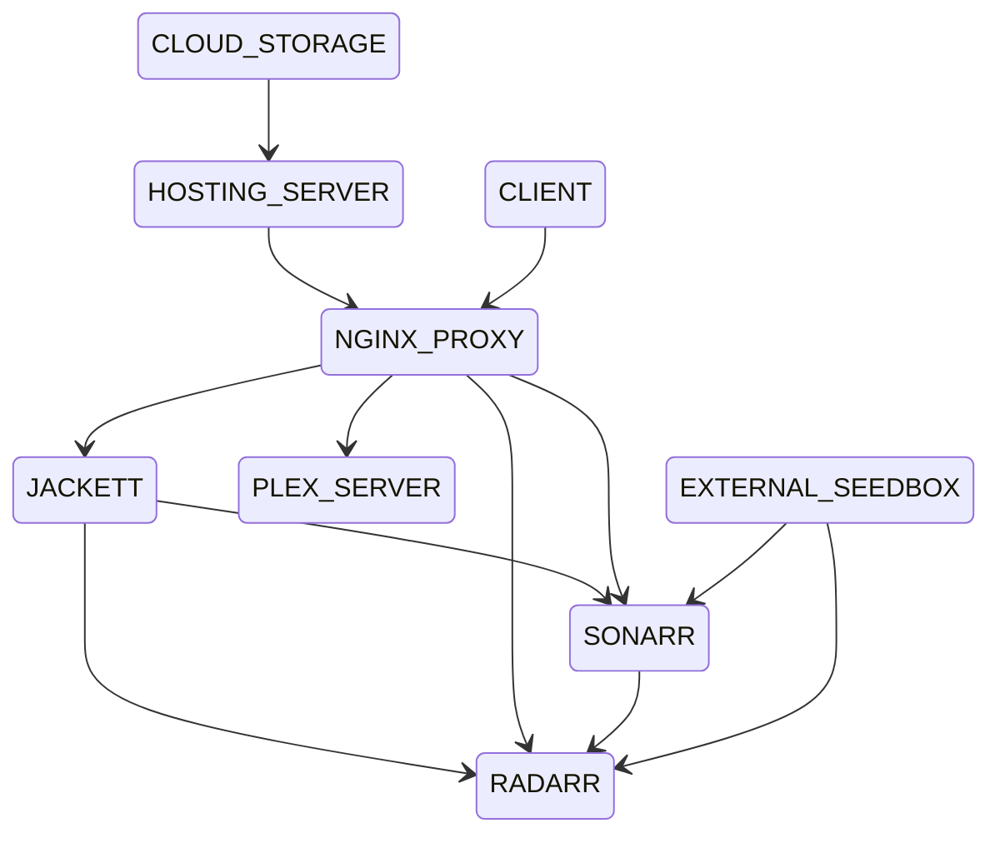

# better-than-netflix
Create your own movie streaming platform on VPS and Seedbox. Orchestration of Plex, Radarr and Jackett services.
I do believe that 

## Stack
Technological stack consists of [Plex](https://www.plex.tv/) (streaming platform), [Radarr](https://radarr.video) (movie searching service), [Jackett](https://github.com/Jackett/Jackett) (proxy server translating queries from raddarr to torrent client), [Rclone](https://rclone.org) client (access to cloud storage), [VPS](https://github.com/Jackett/Jackett) and seedbox (shared storage and clients). 

## Docker containers and architecture

